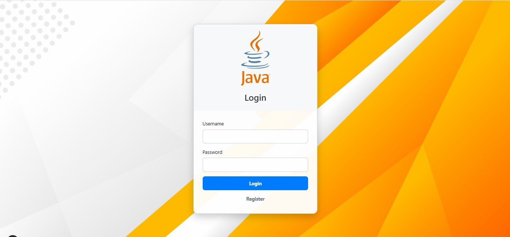

# Note Application

This is a simple Note application built with Spring Boot.

## Features

-   User authentication (Login/Register)
-   Create, view, update, and delete notes

## Login Page

Here's a screenshot of the updated login page:



## Technologies Used

-   Spring Boot
-   Spring Security
-   Thymeleaf
-   Bootstrap 5
-   MySQL (or H2 for development)
-   JWT for API authentication

## Getting Started

### Prerequisites

-   Java 17 or higher
-   Maven
-   MySQL (optional, H2 can be used for quick setup)

### Installation

1.  Clone the repository:
    ```bash
    git clone https://github.com/koswara-dev/note.git
    cd note
    ```

2.  Configure your database in `src/main/resources/application.properties`. For MySQL, uncomment and configure the following:
    ```properties
    # Spring Data JPA
    spring.jpa.hibernate.ddl-auto=update
    spring.jpa.show-sql=true
    spring.jpa.properties.hibernate.dialect=org.hibernate.dialect.MySQL8Dialect

    # MySQL Database
    spring.datasource.url=jdbc:mysql://localhost:3306/note_db?createDatabaseIfNotExist=true&useSSL=false&serverTimezone=UTC
    spring.datasource.username=your_username
    spring.datasource.password=your_password
    ```
    If you prefer to use H2 (in-memory database for development), ensure the following lines are present and configured:
    ```properties
    spring.h2.console.enabled=true
    spring.datasource.url=jdbc:h2:mem:notedb;DB_CLOSE_DELAY=-1;DB_CLOSE_ON_EXIT=FALSE
    spring.datasource.driverClassName=org.h2.Driver
    spring.datasource.username=sa
    spring.datasource.password=
    spring.jpa.database-platform=org.hibernate.dialect.H2Dialect
    ```

3.  Build the project:
    ```bash
    mvn clean install
    ```

4.  Run the application:
    ```bash
    mvn spring-boot:run
    ```

The application will be accessible at `http://localhost:8080`.

## API Endpoints

-   `/api/auth/login` (POST) - Authenticate user and get JWT token
-   `/api/auth/register` (POST) - Register a new user
-   `/api/notes` (GET, POST) - Manage notes (requires JWT)
-   `/api/notes/{id}` (GET, PUT, DELETE) - Manage specific note (requires JWT)

## Web Endpoints

-   `/login` (GET) - Login page
-   `/register` (GET) - Registration page
-   `/notes` (GET) - List notes (requires authentication)
-   `/notes/new` (GET) - Create new note form (requires authentication)
-   `/notes/edit/{id}` (GET) - Edit note form (requires authentication)

## Buy me a coffe

If you like this project and want to support its further development, buy me a coffee!

[](https://www.buymeacoffee.com/kudajengke404)